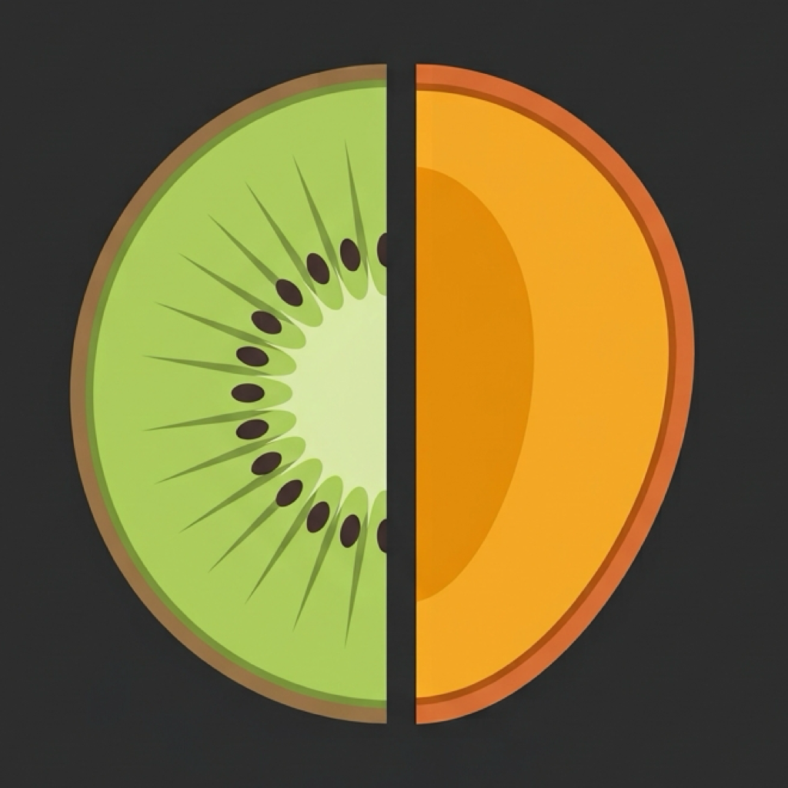
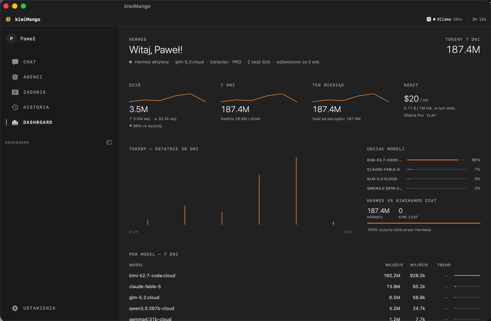

<div align="center">



# kiwiMango

**Natywna aplikacja macOS do czatu z modelami Ollama i uruchamiania agentów kodujących w jednym oknie.**

[](https://www.apple.com/macos)
[](https://swift.org)
[](https://developer.apple.com/xcode/swiftui)
[](https://ollama.com)
[](LICENSE)

</div>



---

## Co to jest

kiwiMango to natywna macOS'owa aplikacja SwiftUI, bez Electrona i bez WebView. Łączy trzy rzeczy w jednym oknie:

- **Czat** z modelami Ollama (lokalnymi i chmurowymi), ze streamingiem odpowiedzi i obsługą obrazów
- **Agenci kodujący** (Claude Code / Hermes Agent / Codex) uruchamiani przez `ollama launch`, każdy w osobnej sesji terminala
- **Dashboard** zużycia tokenów i stanu agenta Hermes — czyta pliki i SQLite bezpośrednio z dysku, bez żadnego serwera pośredniczącego

## Funkcje

**Czat**
- Streaming odpowiedzi, historia rozmów w lokalnym SQLite (GRDB)
- Załączniki obrazów dla modeli wizyjnych
- Renderowanie Markdown, podświetlanie składni, diagramy Mermaid
- Rozpoznawanie i synteza mowy (dyktowanie, odczyt odpowiedzi)
- Command palette (⌘K) i biblioteka promptów (`/`)

**Agenci**
- Sesje Claude Code / Hermes Agent / Codex w natywnym terminalu (SwiftTerm)
- Telemetria agentów i integracja z gatewayem Hermesa (Telegram, cron, pamięć)
- Centrum Dowodzenia (Mission Control) do przełączania i przeglądu aktywnych sesji

**Dashboard**
- Zużycie tokenów: wykresy 30-dniowe, podział na modele, sesje, koszty
- Odczyt stanu Hermesa: cron, pamięć, zdrowie gatewaya — bez dodatkowego backendu

## Wymagania

- macOS 26 lub nowszy
- Xcode / Swift 6 toolchain (do budowania ze źródeł)
- [Ollama](https://ollama.com) z co najmniej jednym pobranym modelem
- Opcjonalnie: konto `ollama.com` (modele chmurowe), gateway Hermesa (agent, Telegram)

## Instalacja

**Z gotowego obrazu**

Pobierz najnowszy `kiwiMango.dmg` z [Releases](https://github.com/lubianiec/kiwiMango/releases), otwórz i przeciągnij do Applications.

**Ze źródeł**

```bash
git clone https://github.com/lubianiec/kiwiMango.git
cd kiwiMango
make run        # buduje i uruchamia
```

Inne cele Makefile:

| Cel | Co robi |
|---|---|
| `make build` | buduje binarkę release i pakuje `.app` |
| `make run` | build + uruchomienie |
| `make install` | instaluje do `/Applications` |
| `make dmg` | tworzy `kiwiMango.dmg` w `~/Downloads` |
| `make clean` | czyści artefakty builda |

## Konfiguracja

- **Ollama** — aplikacja łączy się domyślnie z lokalnym Ollama (`localhost:11434`). Adres hosta i domyślny model ustawiasz w Preferencjach.
- **Agenci** — wymagają `ollama launch claude` (lub odpowiednika dla Hermesa/Codeksa) dostępnego w systemie.
- **Gateway Hermesa** (opcjonalnie) — jeśli masz uruchomiony gateway Hermesa lokalnie, dashboard i czat Hermesa odczytują jego stan (`~/.hermes`) automatycznie; bez niego panele pokazują stan offline.

## Skróty klawiszowe

| Skrót | Akcja |
|---|---|
| `⌘N` | Nowa rozmowa |
| `⌘T` | Nowy agent |
| `⌘P` | Centrum Dowodzenia |
| `⌘F` | Szukaj w rozmowach |
| `⌃⌘S` | Pokaż / ukryj panel boczny |
| `⌘K` | Command palette |
| `/` | Biblioteka promptów |
| `Esc` | Zamknij aktywny panel |

## Stack techniczny

| Warstwa | Technologia |
|---|---|
| UI | SwiftUI, macOS 26 |
| Baza danych | [GRDB](https://github.com/groue/GRDB.swift) 7 + SQLite |
| Terminal | [SwiftTerm](https://github.com/migueldeicaza/SwiftTerm) (PTY) |
| AI | Ollama HTTP API, streaming NDJSON |
| Konfiguracja | [Yams](https://github.com/jpsim/Yams) (YAML) |
| Efekty | Metal (ShaderLibrary) |
| Build | Swift Package Manager + Makefile |

## Struktura kodu

```
Sources/kiwiMango/
├── App.swift          # @main, scenes, skróty globalne
├── RootView.swift      # NavigationSplitView: sidebar + detail
├── Chat/                # stan czatu, widoki, transport HTTP, mowa
├── Agents/              # sesje agentów, terminal, telemetria
├── Dashboard/           # czytniki stanu Hermesa, store, panele
├── Database/            # migracje GRDB, rozmowy, zużycie tokenów
├── Obsidian/            # eksport/synchronizacja z vaultem
├── Components/          # współdzielone komponenty wykresów
└── Shaders/             # efekty Metal
```

## Licencja

[MIT](LICENSE) © Paweł Lubianiec
