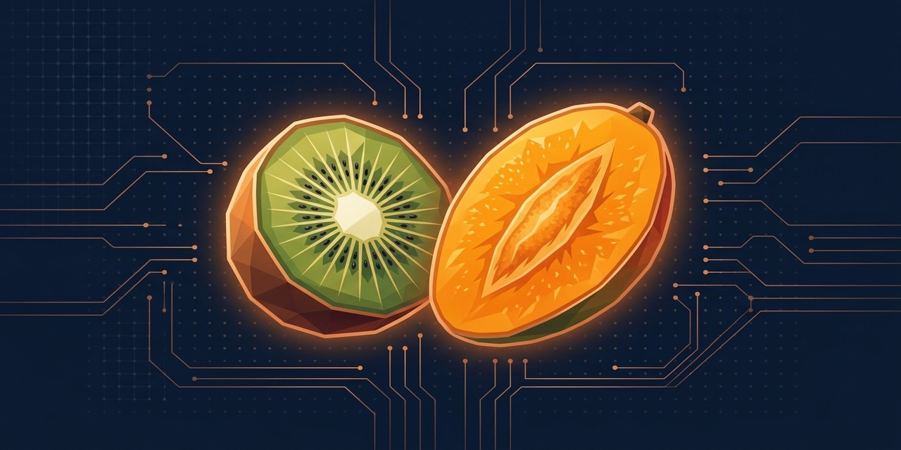

<div align="center">



# kiwiMango

**Native macOS AI client — local and cloud chats plus coding agents in one window.**

[](https://www.apple.com/macos)
[](https://swift.org)
[](https://developer.apple.com/xcode/swiftui)
[](https://ollama.com)
[](https://github.com/lubianiec/kiwiMango/releases/latest)
[](LICENSE)

*Deep navy terminal UI with muted amber/copper accents.*

</div>

---

## Table of contents

- [What it is](#what-it-is)
- [Why kiwiMango](#why-kiwimango)
- [Features](#features)
- [Screenshots](#screenshots)
- [Keyboard shortcuts](#keyboard-shortcuts)
- [Requirements](#requirements)
- [Quick start](#quick-start)
- [Architecture](#architecture)
- [Stack](#stack)
- [Makefile](#makefile)
- [Troubleshooting](#troubleshooting)
- [Contributing](#contributing)
- [Privacy](#privacy)
- [License](#license)

---

## What it is

**kiwiMango** is a native macOS app for chatting with AI models (Ollama) and running autonomous coding agents side by side. No Electron, no browser shell — pure SwiftUI, a local SQLite database, and a built-in terminal powered by SwiftTerm.

It works with local models through Ollama and with an `ollama.com` cloud account, all in one window.

---

## Why kiwiMango

| Problem | How kiwiMango solves it |
|---------|------------------------|
| Electron drains RAM and battery | Native SwiftUI + Metal, no browser background process |
| Chat history in a stranger's cloud | Local SQLite (GRDB), everything stays on your disk |
| Coding agents live in separate terminals | Built-in Claude Code / Hermes Agent / Codex sessions in one window |
| Jumping between chat and tools | Sidebar + Mission Control + Hermes HUD in one app |
| No privacy with local models | Direct connection to Ollama, no middleman |

---

## Features

### Chat AI
- **Streaming responses** with a pulsing cursor and live tok/s stats
- **Markdown** + syntax-highlighted code blocks with a copy button
- **SQLite history** (GRDB) — all conversations stay on your disk
- **Image attachments** for vision models (drag & drop, HEIC → JPEG)
- **Fork conversation**, rename, duplicate, export to Markdown and Obsidian
- **Conversation search** across titles and content
- **Personas** — model profiles with custom system prompts and temperature

### Agents
- Built-in **Claude Code / Hermes Agent / Codex** via `ollama launch`
- **Parallel sessions** — each agent has its own model, working directory, and terminal
- Switching chat ↔ agent does not kill sessions
- Clean shutdown — zero zombie processes when you quit
- Agent history stored in the local database

### Dashboard and status
- **Mission Control** — live overview of all running agents
- **Hermes HUD** — embedded local dashboard for memory, cron jobs, and costs
- **Status bar** with real Ollama ping, latency, and agent count
- **Polish dictation** via `SFSpeechRecognizer`

### Look and feel
- Terminal-inspired interface with deep navy chrome
- Metal effects (live backdrop, bloom, message materialization)
- Responsive sidebar / detail layout

---

## Screenshots

> *Screenshots will be added in a future update. For now, run the app locally to see the UI.*

---

## Keyboard shortcuts

| Shortcut | Action |
|----------|--------|
| `⌘N` | New conversation |
| `⌘T` | New agent |
| `⌘F` | Search conversations |
| `⌃⌘S` | Show / hide sidebar |
| `⇧⏎` | New line in composer |
| `⌘K` | Command palette |
| `/` | Prompt library |
| `⌘P` | Mission Control |

---

## Requirements

- **macOS 26+** (Swift 6 / SwiftUI)
- [Ollama](https://ollama.com/download) with at least one model
- Xcode Command Line Tools
- For agents: `ollama launch claude` (Claude Code through Ollama)

## What works out of the box vs optional

| Feature | Required to run | Status |
|---------|-----------------|--------|
| Ollama chat | Ollama + a model | ✅ always works |
| Claude Code / Hermes / Codex agents | `ollama launch claude` etc. | ⚙️ optional |
| Hermes Gateway chat | `hermes` CLI binary | ⚙️ optional |
| Hermes HUD | Python 3.11+, npm, git | ⚙️ optional |
| Claude Pro models | Subscription + `claude` CLI `/login` | ⚙️ optional |
| Obsidian sync | Vault folder (chosen on first launch) | ⚙️ optional |

---

## Quick start

```bash
git clone https://github.com/lubianiec/kiwiMango.git
cd kiwiMango
make run        # build and run
make install    # install to /Applications
make dmg        # create a distributable image
```

On first launch, kiwiMango asks you to pick the Ollama host, default model, agent working directory, and optional Obsidian vault. You can change all of this later in Preferences.

You can also download a ready-to-use DMG from [GitHub Releases](https://github.com/lubianiec/kiwiMango/releases/latest).

---

## Architecture

```
Sources/kiwiMango/
├── App.swift                  # @main, scenes, global shortcuts
├── RootView.swift             # NavigationSplitView: sidebar + detail
├── DesignSystem.swift         # palette, effects, fonts
├── Chat/                      # chat state, views, HTTP transport
├── Agents/                    # agent sessions, SwiftTerm, telemetry
├── Database/                  # GRDB: migrations, Conversation, StoredMessage
├── HUD/                       # embedded Hermes HUD (WKWebView)
├── Shaders/                   # Metal effects
└── Resources/                 # icons, offline mermaid.js
```

---

## Stack

| Layer | Technology |
|-------|------------|
| UI | SwiftUI (native macOS window, zero Electron) |
| Database | [GRDB 7](https://github.com/groue/GRDB.swift) + SQLite |
| Terminal | [SwiftTerm](https://github.com/migueldeicaza/SwiftTerm) (PTY) |
| AI | Ollama HTTP API (`/api/chat`, NDJSON streaming) |
| Shaders | Metal + SwiftUI ShaderLibrary |
| Build | Swift Package Manager + Makefile |

---

## Makefile

| Command | Description |
|---------|-------------|
| `make build` | Build the app |
| `make run` | Build and run |
| `make install` | Install to `/Applications/kiwiMango.app` |
| `make dmg` | Generate `kiwiMango.dmg` |
| `make clean` | Clean build artifacts |

---

## Troubleshooting

### App won't build
```bash
make clean
make build
```

### App won't open after downloading the DMG

macOS Gatekeeper may block an ad-hoc signed app. Options:
1. Right-click `/Applications/kiwiMango.app` → **Open** (the first time).
2. Or run in Terminal: `xattr -rd com.apple.quarantine /Applications/kiwiMango.app`.

A future release will be signed with an Apple Developer certificate to remove this step.

### Ollama is not detected
Check that Ollama is running:
```bash
curl http://localhost:11434/api/tags
```

### Microphone / dictation permission denied
Go to **System Settings → Privacy & Security → Microphone** and allow kiwiMango.

### Agents won't start
Make sure you have `claude` installed through Ollama:
```bash
ollama launch claude --help
```

---

## Contributing

Pull requests and issues are welcome. If you're planning a larger refactor, open an issue first to discuss direction.

1. Fork the repo
2. Create a branch: `git checkout -b feature/name`
3. Commit your changes
4. Open a PR to `main`

---

## Privacy

- All chat history lives in a local SQLite database
- No middleman in the cloud for local models
- Cloud model access goes directly through Ollama / ollama.com APIs
- No trackers, analytics, or CDN — all UI resources are bundled

---

## License

[MIT](LICENSE) — use, modify, and extend freely.

</div>
