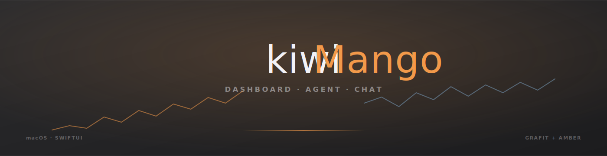
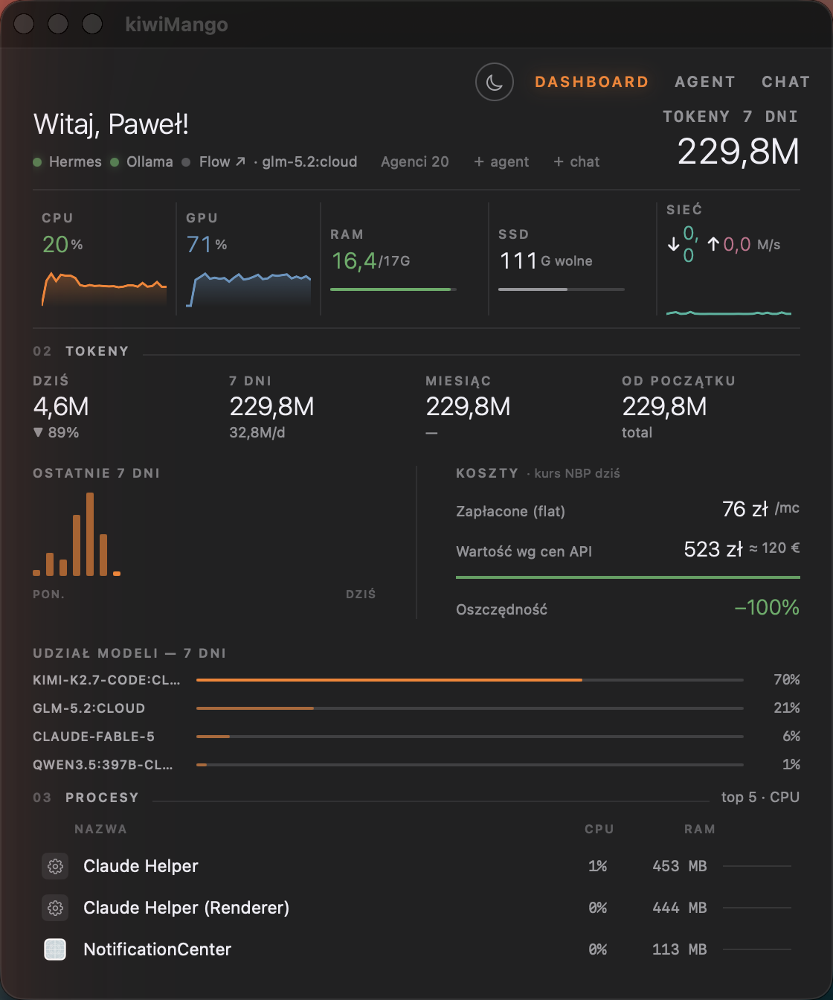
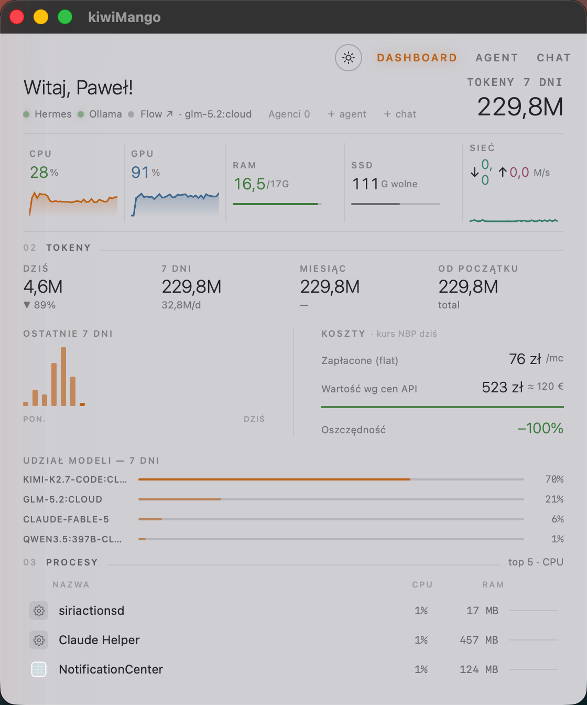
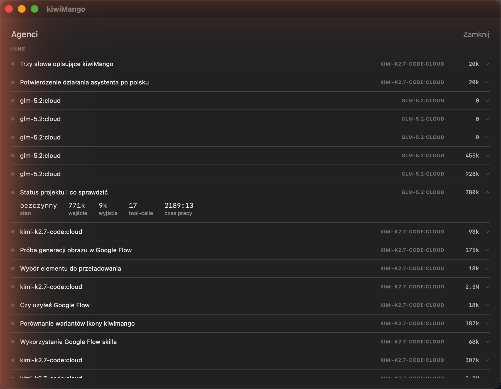
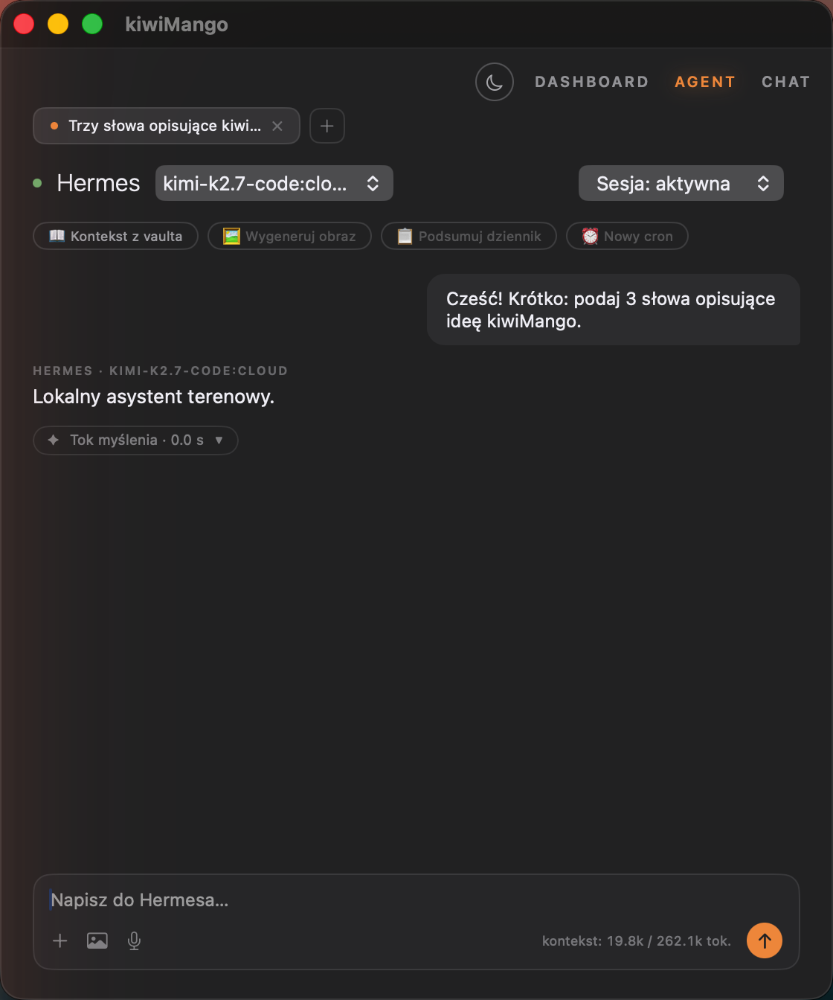
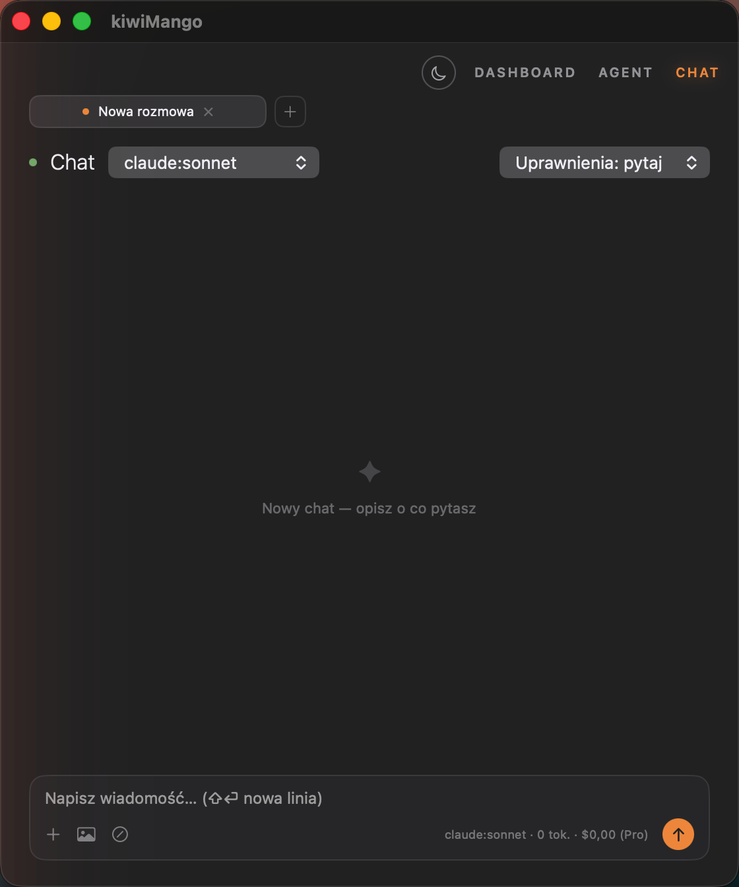

<div align="center">



<br><br>

**Kokpit dla ludzi, którzy rozmawiają z maszynami cały dzień.**

Jedno okno. Trzy strony. Zero szumu.

<br>


</div>

<br>

## Co to jest

kiwiMango to natywna aplikacja macOS, która siedzi w rogu ekranu i pilnuje trzech rzeczy naraz: **ile Twój sprzęt naprawdę robi**, **ile kosztują rozmowy z modelami** i **co w tej chwili myślą Twoi agenci**. Bez przełączania się między Activity Monitor, kartą przeglądarki z rachunkiem a terminalem, w którym coś miga.

Nie jest to dashboard z gotowego szablonu. Każda liczba na ekranie pochodzi z realnego odczytu — licznika jądra, pliku stanu, prawdziwego kursu NBP z dzisiaj. Jeśli czegoś nie da się zmierzyć uczciwie, kiwiMango tego miejsca po prostu nie pokazuje. Żadnych wykresów z zaokrągloną fikcją.

<br>

## Wygląd

<div align="center">
&nbsp;&nbsp;

<br><sub>Dashboard — ciemny grafit i jasny szary, ten sam układ co do piksela</sub>
</div>

<br>

Górny pasek to jedyny nawigator, jaki dostajesz: `DASHBOARD` · `AGENT` · `CHAT`, przełącznik motywu obok. Pod spodem — puls maszyny.

**Pięć komórek sprzętu**, każda z 60-próbkową historią (2 minuty wstecz): procesor rozbity na rdzenie wydajności i mocy, karta graficzna, pamięć ze splitem aplikacje/wired/skompresowane, dysk, sieć z realnym pingiem do 1.1.1.1. Kliknięcie w dysk otwiera **Mole** — pięciozakładkowe centrum sprzątania (Clean / Uninstall / Optimize / Analyze / Status), które liczy realne gigabajty w `~/Library/Caches` i kasuje wyłącznie przez Kosz. Zero `rm -rf`, zero terminala, zero niespodzianek.

<br>

## Agenci, nie tylko liczby

<div align="center">

<br><sub>Osobne, duże okno — bo lista aktywnych sesji zasługuje na własną przestrzeń</sub>
</div>

<br>

Pasek statusu Dashboardu pokazuje jedną liczbę: `Agenci N`. Kliknięcie otwiera pełną listę pogrupowaną po katalogu projektu, z pełnymi nazwami zadań, modelem, tokenami i czasem pracy każdej sesji — bez ucinania po dwudziestu znakach, bez zgadywania.

<br>

## Rozmowa, jedna dla wszystkich

<div align="center">
&nbsp;&nbsp;

<br><sub>Agent i Chat dzielą ten sam silnik rozmowy — różni je tylko to, co siedzi po drugiej stronie</sub>
</div>

<br>

Karty sesji jak w przeglądarce, zwijany tok myślenia, karty uprawnień jak w terminalu, licznik kontekstu na żywo. Rozwinięcie toku myślenia zatrzymuje przewijanie tylko w tym jednym oknie — druga zakładka scrolluje sobie dalej, niezależnie. Drobiazg, który zauważysz dopiero, kiedy go zabraknie.

<br>

## Filozofia

- **Prawdziwe dane albo żadne.** Brak odczytu temperatury na Apple Silicon? Pole znika, nie pokazuje zera.
- **GUI zamiast terminala wszędzie, gdzie się da.** Sprzątanie dysku to pięć zakładek, nie okno z migającym kursorem.
- **Jeden komponent, dwa zastosowania.** Agent i Chat to ten sam widok rozmowy — różnica leży w tym, co odpowiada, nie jak to wygląda.
- **Kosz, nigdy `rm`.** Każde kasowanie jest odwracalne, dopóki sam nie opróżnisz Kosza.

<br>

## Instalacja

```bash
git clone https://github.com/lubianiec/kiwiMango.git
cd kiwiMango
make build
make run
```

Wymagania: macOS 15+, Xcode z toolchainem Swift 6. `make install` kopiuje gotową paczkę do `/Applications`.

<br>

## Struktura

```
Sources/kiwiMango/
  Dashboard/     hero, pasek sprzętu, tokeny, koszty, procesy, Mole
  Session/       wspólny widok rozmowy — taby, tok myślenia, uprawnienia, composer
  Chat/          silniki: gateway, proces claude, Ollama
  Database/      SQLite przez GRDB — jedna baza, cała historia
```

<br>

<div align="center">
<sub>MIT · zbudowane dla jednego biurka, działa na każdym</sub>
</div>
