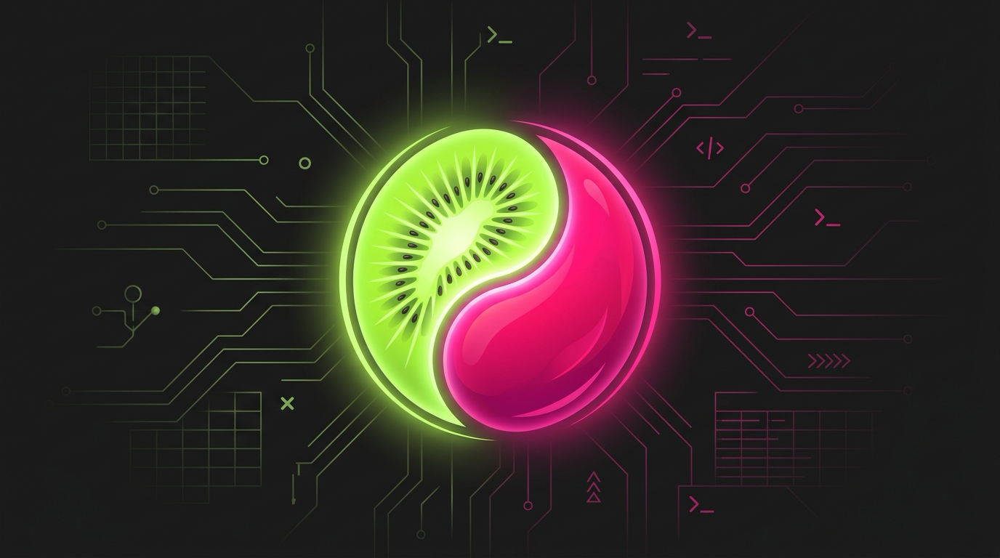

<div align="center">



# kiwiMango

**Natywny klient AI dla macOS — czaty lokalne i chmurowe oraz agenci kodujący w jednym oknie.**

[](https://www.apple.com/macos)
[](https://swift.org)
[](https://developer.apple.com/xcode/swiftui)
[](https://ollama.com)
[](LICENSE)

*Deep Cyberpunk / Neon Noir UI — neonowa limonka i magenta na głębokiej ciemności.*

</div>

---

## 🚀 Co to jest

**kiwiMango** to natywna aplikacja macOS do rozmów z modelami AI (Ollama) i równoległej pracy autonomicznych agentów kodujących. Żadnego Electrona, żadnej przeglądarki jako UI — czysty SwiftUI, lokalna baza SQLite i wbudowany terminal oparty na SwiftTerm.

Działa z modelami lokalnymi poprzez Ollamę oraz z kontem cloud `ollama.com` — wszystko w jednym oknie.

---

## ✨ Główne funkcje

### 💬 Czat AI
- **Streaming odpowiedzi** z pulsującym kursorem i statystykami tok/s
- **Markdown** + kolorowanie składni z przyciskiem „kopiuj" dla każdego bloku kodu
- **Historia w SQLite** (GRDB) — wszystkie rozmowy zostają na Twoim dysku
- **Załączniki obrazów** do modeli vision (drag & drop, HEIC → JPEG)
- **Fork rozmowy**, zmiana nazwy, duplikowanie, eksport do Markdown i Obsidian
- **Wyszukiwarka** rozmów po tytułach i treści
- **Persony** — profile modeli z własnym system promptem i temperaturą

### 🤖 Agenci
- Wbudowane sesje **Claude Code / Hermes Agent / Codex** poprzez `ollama launch`
- **Równoległe sesje** — każdy agent ma swój model, katalog roboczy i terminal
- Przełączanie czat ↔ agent nie ubija sesji
- Czyste zamykanie — zero procesów-zombie po wyjściu z aplikacji
- Historia agentów zapisywana w bazie

### 🎛 Dashboard i status
- **Centrum Dowodzenia** — podgląd wszystkich żywych agentów
- **Hermes HUD** — osadzony lokalny dashboard pamięci, cronów i kosztów
- **Status bar** z realnym pingiem Ollamy, latencją i licznikiem agentów
- **Dyktowanie** po polsku przez `SFSpeechRecognizer`

### 🎨 Wygląd
- Neonowy interfejs inspirowany terminalami cyberpunk
- Efekty Metal (żywe tło, bloom, materializowanie wiadomości)
- Responsywny layout sidebar / detail

---

## 📸 Zrzuty ekranu

> *Zrzuty ekranu zostaną dodane w kolejnej iteracji. Tymczasem możesz zobaczyć UI uruchamiając aplikację lokalnie.*

---

## ⌨️ Skróty klawiszowe

| Skrót | Akcja |
|-------|-------|
| `⌘N` | Nowa rozmowa |
| `⌘T` | Nowy agent |
| `⌘F` | Szukaj rozmów |
| `⌃⌘S` | Schowaj / pokaż panel boczny |
| `⇧⏎` | Nowa linia w polu wiadomości |
| `⌘K` | Paleta komend |
| `/` | Biblioteka promptów |
| `⌘P` | Centrum Dowodzenia |

---

## 🛠 Wymagania

- **macOS 26+** (Swift 6 / SwiftUI)
- [Ollama](https://ollama.com/download) z co najmniej jednym modelem
- Xcode Command Line Tools
- Dla agentów: `ollama launch claude` (Claude Code przez Ollamę)

---

## ⚡ Szybki start

```bash
git clone https://github.com/lubianiec/kiwiMango.git
cd kiwiMango
make run        # zbuduj i uruchom
make install    # zainstaluj w /Applications
make dmg        # utwórz obraz dystrybucyjny
```

Po pierwszym uruchomieniu aplikacja łączy się z lokalną Ollamą (domyślnie `http://localhost:11434`). Jeśli używasz konta cloud, ustawienia znajdziesz w oknie Preferencji.

---

## 🧱 Architektura

```
Sources/kiwiMango/
├── App.swift                  # @main, sceny, skróty globalne
├── RootView.swift             # NavigationSplitView: sidebar + detail
├── DesignSystem.swift         # paleta Neon Noir, efekty, czcionki
├── Chat/                      # czat: stan, widoki, transport HTTP
├── Agents/                    # sesje agentów, SwiftTerm, telemetry
├── Database/                  # GRDB: migracje, Conversation, StoredMessage
├── HUD/                       # osadzony Hermes HUD (WKWebView)
├── Shaders/                   # efekty Metal
└── Resources/                 # ikony, mermaid.js offline
```

---

## 🧩 Stack

| Warstwa | Technologia |
|---------|-------------|
| UI | SwiftUI (natywne okno macOS, zero Electrona) |
| Baza | [GRDB 7](https://github.com/groue/GRDB.swift) + SQLite |
| Terminal | [SwiftTerm](https://github.com/migueldeicaza/SwiftTerm) (PTY) |
| AI | Ollama HTTP API (`/api/chat`, NDJSON streaming) |
| Shadery | Metal + SwiftUI ShaderLibrary |
| Build | Swift Package Manager + Makefile |

---

## 📦 Makefile

| Komenda | Opis |
|---------|------|
| `make build` | Zbuduj aplikację |
| `make run` | Zbuduj i uruchom |
| `make install` | Zainstaluj w `/Applications/kiwiMango.app` |
| `make dmg` | Wygeneruj `kiwiMango.dmg` |
| `make clean` | Wyczyść build |

---

## 🔒 Prywatność

- Cała historia czatów mieszka w lokalnej bazie SQLite
- Brak pośrednika w chmurze dla modeli lokalnych
- Obsługa modeli cloud odbywa się bezpośrednio przez API Ollamy / ollama.com
- Żadnych trackerów, analityki ani CDN — wszystkie zasoby UI są bundlowane

---

## 📝 Licencja

[MIT](LICENSE) — używaj, modyfikuj i rozwijaj. Pull requesty mile widziane.

---

<div align="center">

*Zbudowane w duecie człowiek + Claude. 🥝🥭*

</div>
