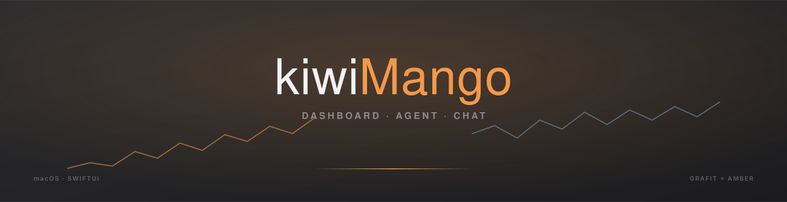

<div align="center">



<br><br>

**Okno rozmowy z agentem. Nic poza tym.**

Jedno okno. Jedna strona. Zero szumu.

<br>


</div>

<br>

## Co to jest

kiwiMango to natywna aplikacja macOS do rozmowy z agentami kodującymi — Grok, GLM, Kimi, Qwen, MiniMax — w oknie, które wygląda i czyta się jak terminal, ale zachowuje się jak porządna aplikacja.

Wcześniejsze wersje miały drugą stronę z paskiem sprzętu i kosztami. **Została skasowana w wersji 1.4.0** — dublowała Stats.app z paska menu i odciągała uwagę od jedynej rzeczy, dla której ta aplikacja jest otwarta. Statystyki tokenów i kosztów żyją dalej, ale w zdalnym interfejsie webowym (patrz niżej).

<br>

## Okno rozmowy

Strumień, nie czat. Nie ma dymków, nie ma awatarów, nie ma naprzemiennych kolorów tła.

**Twoje wiadomości** dostają prompt `❯` i mono, jak wpisane w powłokę. **Odpowiedzi agenta** są wcięte, bez prefiksu, z włoskowatą pionową linią w rynnie — i są najmocniejszym tekstem w oknie (SF Pro 15pt, interlinia 1,72). Tekst modelu ma być czytany, logi mają być przeglądane; typografia mówi to wprost.

**Wywołania narzędzi** pokazują wynik z hakiem `⎿`, dokładnie jak w terminalu. **Tok myślenia** zwija się i rozwija; rozwinięcie zatrzymuje autoprzewijanie tylko w tej jednej karcie — druga scrolluje sobie dalej. **Karty uprawnień** wyglądają jak w terminalu i tak samo działają.

Na pasku tytułowym widać, co się dzieje: spinner, nazwa narzędzia, czas. Gdy agent nic nie robi — sama zielona kropka, bez napisu.

**Composer to prompt, nie pudełko.** Pusta nowa sesja wita cytatem zamiast pustki.

<br>

## Sesje i historia

Karty jak w przeglądarce, z `＋`. Każda sesja zapisuje się na dysk jako pełny zapis rozmowy, nie skrót. Zamknięcie karty niczego nie kasuje: wpis czeka w menu `🕘 HISTORIA`, posortowany od najnowszego. Klik wraca do pełnej rozmowy i można pisać dalej — dokładnie tam, gdzie się skończyło, także po restarcie aplikacji.

Osobne okno **Agenci** (`⌘⇧A`) pokazuje wszystkie sesje z `~/.hermes/state.db` pogrupowane po katalogu projektu: pełna nazwa zadania, model, tokeny, czas pracy. Bez ucinania po dwudziestu znakach.

<br>

## Modele

Rozmowa idzie przez bramkę Hermesa. Dostępne z pudełka:

| Model | Provider |
|---|---|
| `grok-4.5` | `xai-oauth` — OAuth SuperGrok przez `hermes auth`, **bez klucza API w aplikacji** |
| `kimi-k2.7-code:cloud` | `ollama-launch` |
| `glm-5.2:cloud` | `ollama-launch` |
| `qwen3.5:cloud` | `ollama-launch` |
| `minimax-m3:cloud` | `ollama-launch` |

<br>

## Zdalny dostęp z telefonu

Wbudowany serwer HTTP (Network.framework, zero dodatkowych zależności) serwuje interfejs React pod stałym portem, ze stałym tokenem zapisanym na dysk — zakładka w telefonie działa dalej po restarcie Maca, bez gonienia za nowym adresem.

To jest **jedyne miejsce, gdzie żyją liczby**: obciążenie sprzętu, tokeny (dziś / 7 dni / miesiąc / od początku), udział procentowy modeli i koszty przeliczone kursem NBP z bieżącego dnia. Natywna aplikacja świadomie ich nie pokazuje.

<br>

## Filozofia

- **Prawdziwe dane albo żadne.** Brak odczytu temperatury na Apple Silicon? Pole znika, nie pokazuje zera.
- **Jedno okno robi jedną rzecz.** Jak coś dubluje narzędzie, które już masz — wylatuje, nawet jeśli ładnie wyglądało.
- **Nic nie znika bez pytania.** Zamknięcie karty to nie usunięcie rozmowy — historia trzyma ją, dopóki sam jej nie skasujesz.
- **Typografia to hierarchia.** Odpowiedź modelu jest ważniejsza niż stdout i ma to widać z drugiego końca biurka.

<br>

## Instalacja

```bash
git clone https://github.com/lubianiec/kiwiMango.git
cd kiwiMango
make build
make run
```

Wymagania: macOS 26+, Xcode z toolchainem Swift 6, Node (do zbudowania interfejsu webowego — `make build` robi to sam).

`make install` kopiuje gotową paczkę do `/Applications`. `make dmg` składa obraz w `~/Downloads`. `make status` mówi jednym spojrzeniem, czy lokalny kod, GitHub i zainstalowana aplikacja to wciąż to samo.

<br>

## Struktura

```
Sources/kiwiMango/
  Session/       okno rozmowy — taby, historia, tok myślenia, uprawnienia, composer
  Chat/          bramka Hermesa, kolorowanie składni, markdown, licznik tokenów
  Data/          odczyty sprzętu, stan Hermesa, kursy NBP, cennik modeli, cytaty
  Remote/        serwer HTTP + konfiguracja zdalnego interfejsu
  Database/      SQLite przez GRDB — jedna baza, cała historia
  Nav/           przełącznik motywu
web/             interfejs zdalny (React + Vite)
```

> `Data/` nie ma już własnego widoku w natywnej aplikacji — czyta go wyłącznie `Remote/`. To nie jest martwy kod.

<br>

## Twórcy

Zaprojektowane i rozwijane przez **Paweł Lubianiec**.

<br>

<div align="center">
<sub>MIT · zbudowane dla jednego biurka, działa na każdym</sub>
</div>
